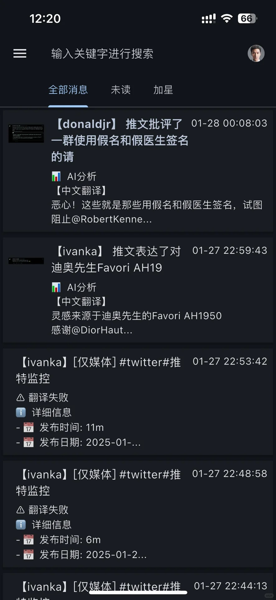
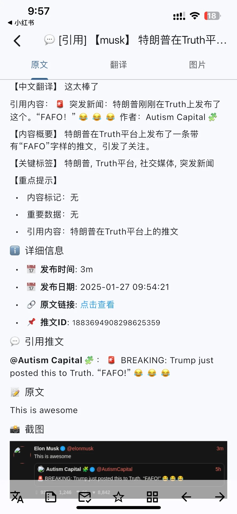

# Twitter Monitor

<p align="center">
  
</p>

A powerful tool for monitoring Twitter users through Nitter instances, featuring AI-powered translation, analysis, and smart notification system.

[中文文档](README.zh.md)

## Key Features

### 🤖 AI-Powered Analysis
- Intelligent content categorization with emojis:
  - 💰 Cryptocurrency related
  - 🚀 Space exploration
  - 🤖 Artificial Intelligence
  - 💊 Important policies/announcements
  - 🀄 Other significant content
- DeepSeek API integration for accurate translation
- Smart content summarization and key points extraction

### 🌐 Reliable Data Collection
- Uses steel-browser (browserless/chrome) for stable web scraping
- Automatic instance health monitoring and switching
- Screenshot capture for tweet preservation

### 📊 Information Advantage
- Monitor influential figures' real-time opinions
- Track cryptocurrency market sentiment
- Proactive information gathering instead of passive subscription
- Quick translation and key information extraction

## Preview

### Tweet List


### Tweet Detail


## Use Cases

- 📈 Cryptocurrency market monitoring
- 🗣️ Public figure statement tracking
- 📰 Breaking news early detection
- 💡 Tech trend analysis
- 📊 Market sentiment analysis

## Features

- 🔄 Monitor Twitter users through multiple Nitter instances
- 🌐 Automatic instance switching and health monitoring
- 📷 Automatic screenshot capture of tweets
- 🔔 Support multiple push channels (ServerChan, PushDeer)
- 🤖 AI-powered translation and analysis
- 🖼️ Built-in image server for screenshot viewing
- 🐳 Docker support for easy deployment

## Quick Start

1. Clone the repository:
  ```bash
  git clone https://github.com/yourusername/twitter-monitor.git
  cd twitter-monitor
  ```

2. Copy and configure environment file:
  ```bash
  cp .env.example .env
  # Edit .env with your settings
  ```

3. Start with Docker Compose:
  ```bash
  docker-compose -f docker-compose-demo.yaml up -d
  ```

## Configuration

### Environment Variables

Key environment variables in `.env`:

- `TWITTER_USERS`: List of users to monitor (format: `alias:username,alias2:username2`)
- `CHECK_INTERVAL`: Check interval in seconds
- `DEEPSEEK_KEY`: Your DeepSeek API key for translation
- `PUSH_KEY`/`SC_KEY`: Push notification keys

### Docker Configuration

The demo setup includes:
- Twitter monitor service
- Browserless Chrome for web scraping
- Persistent storage for archives and screenshots
- Image server for viewing screenshots

## Push Channels

Supported push channels:
- ServerChan
- PushDeer

## Directory Structure

- `/archives`: Tweet archives
- `/data/screenshots`: Tweet screenshots
- `/logs`: Application logs

## Development

1. Create virtual environment:
  ```bash
  python -m venv .venv
  source .venv/bin/activate  # Linux/Mac
  # or
  .venv\Scripts\activate  # Windows
  ```

2. Install dependencies:
  ```bash
  pip install -r requirements.txt
  ```

3. Run tests:
  ```bash
  python -m pytest tests/
  ```

## License

MIT License

## Contributing

Contributions are welcome! Please feel free to submit a Pull Request. 