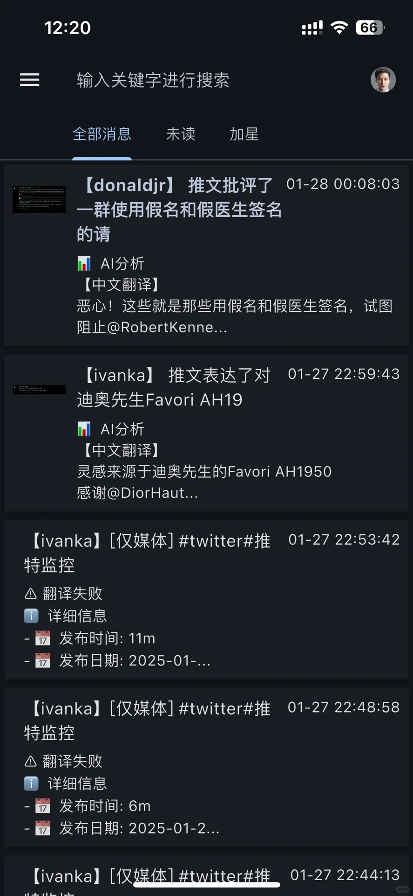

# Twitter 监控工具

<p align="center">
  
</p>

一个强大的 Twitter 用户监控工具，具备 AI 驱动的翻译、分析和智能通知系统。

## 核心特点

### 🤖 AI 驱动分析
- 智能内容分类（带表情标记）：
  - 💰 加密货币相关
  - 🚀 太空探索
  - 🤖 人工智能
  - 💊 重要政策/公告
  - 🀄 其他重要内容
- 集成 DeepSeek API 实现精准翻译
- 智能内容摘要和要点提取

### 🌐 可靠的数据采集
- 使用 steel-browser (browserless/chrome) 实现稳定抓取
- 自动的实例健康监控和切换
- 推文截图保存功能

### 📊 信息优势
- 实时监控影响力人物的观点
- 追踪加密货币市场动态
- 主动的信息获取而非被动订阅
- 快速翻译和关键信息提取

## 效果预览

### 推文列表


### 推文详情


## 应用场景

- 📈 加密货币市场监控
- 🗣️ 公众人物言论跟踪
- 📰 突发新闻早期发现
- 💡 科技趋势分析
- 📊 市场情绪分析

## 功能特点

- 🔄 通过多个 Nitter 实例监控 Twitter 用户
- 🌐 自动切换实例和健康监控
- 📷 自动截取推文截图
- 🔔 支持多种推送渠道（ServerChan、PushDeer）
- 🤖 AI 驱动的翻译和分析
- 🖼️ 内置图片服务器查看截图
- 🐳 支持 Docker 部署

## 快速开始

1. 克隆仓库：
  ```bash
  git clone https://github.com/yourusername/twitter-monitor.git
  cd twitter-monitor
  ```

2. 复制并配置环境文件：
  ```bash
  cp .env.example .env
  # 编辑 .env 文件配置你的设置
  ```

3. 使用 Docker Compose 启动：
  ```bash
  docker-compose -f docker-compose-demo.yaml up -d
  ```

## 配置说明

### 环境变量

`.env` 文件中的主要配置项：

- `TWITTER_USERS`: 要监控的用户列表（格式：`别名:用户名,别名2:用户名2`）
- `CHECK_INTERVAL`: 检查间隔（秒）
- `DEEPSEEK_KEY`: DeepSeek API 密钥（用于翻译）
- `PUSH_KEY`/`SC_KEY`: 推送通知密钥

### Docker 配置

示例配置包含：
- Twitter 监控服务
- Browserless Chrome 用于网页抓取
- 持久化存储（存档和截图）
- 图片服务器（查看截图）

## 推送渠道

支持的推送渠道：
- ServerChan（方糖）
- PushDeer

## 目录结构

- `/archives`: 推文存档
- `/data/screenshots`: 推文截图
- `/logs`: 应用日志

## 开发说明

1. 创建虚拟环境：
  ```bash
  python -m venv .venv
  source .venv/bin/activate  # Linux/Mac
  # 或
  .venv\Scripts\activate  # Windows
  ```

2. 安装依赖：
  ```bash
  pip install -r requirements.txt
  ```

3. 运行测试：
  ```bash
  python -m pytest tests/
  ```

## 许可证

MIT License

## 贡献

欢迎提交 Pull Request 来改进项目！

## 联系方式

- 微信号: zhikoulin (备注: 推送)
- 欢迎一起讨论和交流使用心得

## 赞赏支持

如果这个项目对你有帮助，欢迎赞赏支持：

<p align="center">
  
</p>

> 赞赏的同学请备注你的称呼，感谢支持！ 